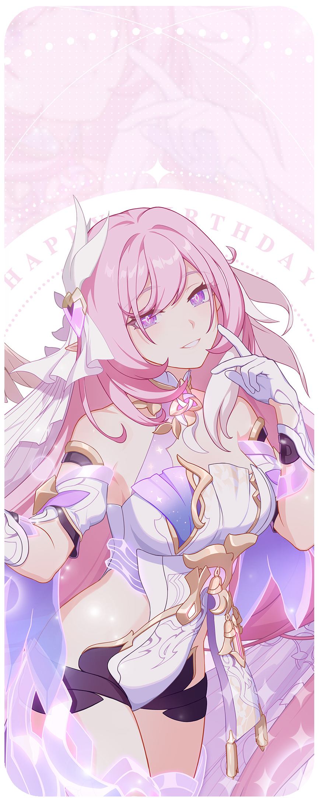

### My status:

I'm currently going through a rough patch (possibly dealing with depression) and need to take a break from activities on GitHub (and even from being online on Discord for a while). Hopefully, by June, once I've managed to improve my mood, I'll be able to return to my main projects on GitHub. Until then, I won't be very active on GitHub (and likely on Discord as well).

I sincerely apologize to everyone waiting for updates on my projects, as well as to those who have supported me through sponsorships.

Love you all.

---

I’ve been banned from Discord for allegedly being underage (???). I’m currently appealing the decision, and my account is not accessible at the moment. Please don’t send me any messages on Discord for now.

---

#

 

 
 
  
-  Student from Vietnam  
-  I am ~18 years old. 
- 🎮 I enjoy playing Open-world, FPS Games, Adventure, Platformer, Rhythm *and some lewd visual novels (shhh, don't tell anyone!)*     
  ↳ **Some games:**  [Muse Dash](https://store.steampowered.com/app/774171/Muse_Dash/),  [Osu!](https://osu.ppy.sh/),  [HI3rd](https://honkaiimpact3.hoyoverse.com/asia/vi-vn/home),  [Honkai: Star Rail](https://hsr.hoyoverse.com/vi-vn/home),  [Strinova](https://www.strinova.com/), ...

- I'm quite skilled with  JavaScript,  [NodeJS](https://nodejs.org/) and  TypeScript
- I can read and understand some code written in  [Python](https://www.python.org/) and  C++
- I’m currently learning  [Go](https://go.dev/) and  C#

 

 
 
  
- 📗 [***aiko-chan-ai/discord.js-selfbot-v13***](https://github.com/aiko-chan-ai/discord.js-selfbot-v13)  
  An unofficial discord.js fork for creating selfbots
- 📘 [***aiko-chan-ai/DiscordBotClient***](https://github.com/aiko-chan-ai/DiscordBotClient)  
  A patched version of discord, with bot login support
 

 

  *“It's not bad for the leading actress to play a charming villain for a change ♪.” – Elysia* 

## Discord

## My stats:

  

## Commits

## Sponsors image

## Star History

## Thanks for reading ❤️
