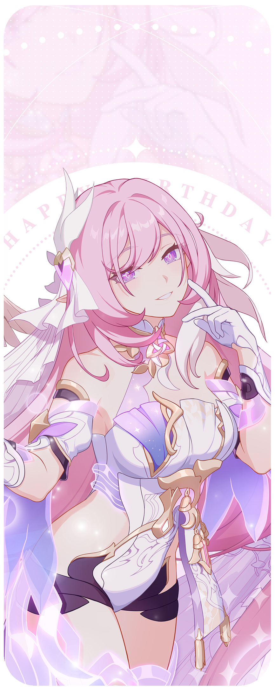
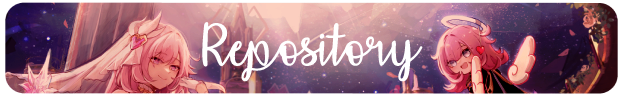

#

 

 
 
  
-  A normal student from Vietnam 
- 🎮 I enjoy playing Open-world, FPS Games, Adventure, Gacha Games, Rhythm *and some lewd visual novels (shhh, don't tell anyone!)*     
  ↳ **Some games:**  [Muse Dash](https://store.steampowered.com/app/774171/Muse_Dash/),  [Osu!](https://osu.ppy.sh/),  [HI3rd](https://honkaiimpact3.hoyoverse.com/asia/vi-vn/home),  [Honkai: Star Rail](https://hsr.hoyoverse.com/vi-vn/home),...

- I'm quite skilled with  JavaScript,  [NodeJS](https://nodejs.org/) and  TypeScript
- I can read and understand some code written in  [Python](https://www.python.org/),  C#,  Java and  C++
- I’m currently learning  [Go](https://go.dev/) and  [Rust](https://rust-lang.org/)

 

 
 
  
- 📘 [***aiko-chan-ai/DiscordBotClient***](https://github.com/aiko-chan-ai/DiscordBotClient)  
  A patched version of discord, with bot login support
- 📗 [***aiko-chan-ai/discord.js-selfbot-v13***](https://github.com/aiko-chan-ai/discord.js-selfbot-v13)  
  An unofficial discord.js fork for creating selfbots

 

 

  *“It's not bad for the leading actress to play a charming villain for a change ♪.” – Elysia* 

## Discord

## My stats:

  

## Commits

## Sponsors image

## Star History

## Thanks for reading and sponsoring me ❤️
